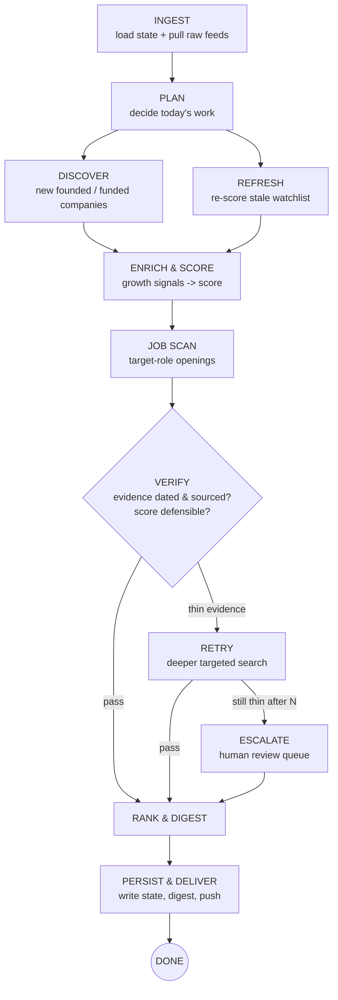

# AI Industry Research — Agent Loop Design

> Status: **DRAFT for approval.** No task execution yet. This document designs the
> reusable daily research loop. Once approved, we run one test case and iterate.

---

## 0. One-paragraph summary

A **stateful daily agent loop** that maintains a persistent, evidence-backed
*watchlist* of AI companies. Each morning it (a) discovers newly founded /
newly funded AI companies, (b) refreshes growth signals on companies already
tracked, (c) scans for open roles matching Wylie's skill set, (d) scores each
company on **quantifiable growth** (not hype), and (e) delivers a curated digest:
*how the industry moved in the last 24–48h, which companies to follow, and which
to consider applying to.* State persists between runs so every digest is a
**delta** on the day before.

Target user profile (skills to match against roles):
Sales Engineer · Solutions Engineer · Product Manager · Partner/Partnerships ·
technical-GTM. Source: https://www.linkedin.com/in/wylie-brown/

---

## 1. Goal & exact completion criteria

**Goal:** Every day, produce a trustworthy, evidence-backed view of which AI
companies are demonstrating *real, quantifiable growth*, plus a curated shortlist
of companies worth following and roles worth considering.

**A daily run is DONE when all of these are true:**

| # | Completion criterion | Machine-checkable evidence |
|---|----------------------|----------------------------|
| C1 | Watchlist refreshed — every company whose signals are older than the staleness window has been re-scored | `last_updated >= now - staleness_window` for all `status != archived` |
| C2 | New candidates discovered & triaged — funding/launch feeds for the last 48h processed | `discovery_run.sources_covered == expected_sources`; each candidate has a triage verdict |
| C3 | Job scan complete — every active watchlist company checked for target-role openings | `job_scan.companies_scanned == active_watchlist.count` |
| C4 | Every surfaced claim is evidence-backed — source URL + retrieval date + the specific claim | `0` items in digest with empty `evidence[]` |
| C5 | Growth scores computed with confidence | every scored company has `growth_score`, `score_breakdown`, `confidence` |
| C6 | Digest generated — new companies, funding in last 24–48h, top movers, matching jobs | `digest.md` exists for today with all sections populated (or explicit "none") |
| C7 | State persisted & deltas computed | `state.db` written; `digest.deltas` computed vs previous run |
| C8 | Digest delivered | delivery receipt logged (file committed / message sent) |

**The loop is NOT done** if any company appears in the digest without dated
source evidence (C4 is the hard gate — this is what separates signal from hype).

---

## 2. The graph: input → plan → act → verify → retry/escalate → done



Two act-branches (DISCOVER for new, REFRESH for known) converge into a single
ENRICH & SCORE stage so scoring logic lives in one place.

---

## 3. Node specifications

### N1 — INGEST
- **Context needed:** persistent `state.db` (watchlist + last-run metadata),
  source registry (feed list), config (staleness window, role targets, budgets).
- **Tools:** state store reader; RSS/Atom fetchers; public JSON board APIs
  (Greenhouse/Lever/Ashby); WebSearch/WebFetch; GitHub API; deterministic TS fetchers.
- **Output:** `raw_signals[]` (funding items, launches, feed entries) + loaded watchlist.
- **Evidence it worked:** non-empty raw pull with per-item source URL + fetch timestamp; state loaded without schema error.

### N2 — PLAN
- **Context:** loaded watchlist, raw signals, staleness window, per-run caps.
- **Tools:** LLM reasoning (no external calls); state store.
- **Output:** a work list — `{discover: sources[], refresh: company_ids[], budget_allocation}`.
- **Evidence:** work list bounded by caps (≤ max_candidates/day, ≤ max_refresh/day); every stale company queued or explicitly deferred with reason.

### N3 — DISCOVER (act)
- **Context:** funding/launch feeds, "AI" classification heuristics, existing watchlist (to dedup).
- **Tools:** WebSearch, WebFetch, RSS, YC/Product Hunt/HN sources, funding-news queries.
- **Output:** `candidates[]` with {name, domain, why_surfaced, source_url, date}.
- **Evidence:** each candidate has ≥1 dated source; dedup rate reported; count within cap.
- **Identity rule (from E4):** the canonical key is the **normalized primary domain**,
  never the display name (companies appear as "HappyRobot" / "Happyrobot Inc." /
  "happyrobot.ai"). Keep an `aliases[]` set; on a "new" candidate, resolve domain →
  if it matches an existing record, **REFRESH** it (don't insert). Generic names
  ("June") collide with unrelated entities → never match/merge on name without a
  domain; if no domain resolves, route to the review queue rather than guess.

### N4 — REFRESH (act)
- **Context:** watchlist companies past staleness window + their prior signals.
- **Tools:** same as ENRICH; board APIs; WebSearch; GitHub.
- **Output:** updated signal set per company.
- **Evidence:** `last_updated` bumped; changed fields diffed against prior snapshot.

### N5 — ENRICH & SCORE (act)  ← core value
- **Context:** candidate/refresh company + its raw signals + scoring rubric.
- **Tools:** WebFetch (company site/careers), Greenhouse/Lever/Ashby JSON, GitHub API, WebSearch (funding/news), LLM for synthesis.
- **Output:** per company: normalized **growth signals** + a **Growth Score (0–100)** with breakdown + confidence + `evidence[]`.
- **Evidence:** score reproducible from breakdown; every contributing signal cites a dated source.

**Growth signal taxonomy (quantifiable-first):**

| Signal | Source (free/public) | Weight class |
|--------|----------------------|--------------|
| New funding round (amount, date, investors, valuation) | funding news, WebSearch | High |
| Hiring velocity (open roles now vs 30d ago) | Greenhouse/Lever/Ashby JSON | High |
| Headcount trend | LinkedIn public / news (coarse) | Medium |
| Job-board breadth (departments hiring) | board APIs | Medium |
| Product traction (GitHub stars velocity, PH upvotes) | GitHub API, Product Hunt | Medium |
| News/PR volume (30d), customer/partnership announcements | WebSearch/news | Low–Medium |
| Web presence momentum | search result recency | Low |

Confidence is lowered when signals are PR-only, undated, or single-sourced.

**Funding event ≠ growth (from E2 — critical).** A dated round with a marquee cap
table is a *funding event*, not proof of *quantifiable growth*. The two are scored
and surfaced separately so a well-backed pre-seed can't masquerade as a grower:
- **`funding_event`** — logged as a dated fact; always eligible for the digest's
  Funding section regardless of growth score.
- **`growth_score`** — measures *traction* (customers, hiring velocity, headcount
  trend, revenue). A pre-seed with 4 people and one anecdotal customer scores **low**
  here even if famous people invested.
- **`stage` tag** (pre-seed → C+) contextualizes every score.
- **Digest buckets:** **Top Movers** requires quantifiable growth. Companies that are
  freshly/well-funded but traction-unproven go in a distinct **"Notable but unproven"**
  bucket — visible, but never miscounted as growth.

**Enrich before downgrading (from E2).** A thin *discovery* source ≠ a thin company.
June AI showed "no metrics" on the aggregator listing but enrichment found a dated
$20M round. Always run enrichment before concluding "no signal"; judge on enriched
evidence, not on how sparse the discovery listing was.

**Aspirational ≠ actual (from E2).** Forward-looking claims ("a customer pursuing 100
agents", "targeting $X ARR") are goals, not metrics — routed to the review queue and
never counted as traction.

**Rumor ≠ round (from E5).** Classify funding language before creating a
`funding_event`: "in talks / reportedly / is seeking / could raise" → **rumor**
(review queue, `rumored_unconfirmed`); "raised / closed / announced / led by" →
**event** (eligible for the Funding section). And **corroboration must be
independent** — N outlets echoing one paywalled report count as **one** source, not
N; trace secondaries to origin. A paywalled/unreachable primary is *unverifiable, not
false*: escalate and set a watch to auto-promote if the round later closes with a
verifiable dated source.

### N6 — JOB SCAN (act)
- **Context:** active watchlist companies + Wylie's target titles + seniority + locations.
- **Tools:** Greenhouse/Lever/Ashby board APIs (**primary source of truth — reliable JSON**), company career pages, Google Jobs / Work-at-a-Startup / Wellfound (secondary, discovery only — never for counts).
- **Output:** `matching_jobs[]` {company, title, url, location, posted_date, role_match_score, **fit_caveat**}.
- **Evidence:** each job has a live URL + posted date; match score explains why it fits SE/SolE/PM/Partner.
- **Rule (from E1):** job **counts and role data come only from the company's ATS
  JSON** — aggregators (Glassdoor/Scoutify) routinely inflate counts and must be
  ignored, not averaged. Counting happens in the TS fetcher, never in the LLM.
- **Rule (from E1) — `fit_caveat`:** title-match is not fit. Extract the JD's actual
  skill demands and flag divergence from Wylie's GTM-lean profile (e.g. an FDE/SolE
  title whose JD is heavy full-stack coding → "strong title match, confirm coding
  depth"). Surface an honest signal; never auto-filter (apply decision is human-gated).
- **`role_watch` primitive:** a company may carry a role-watch (e.g. "PM", "Partner").
  When a future posting matches a watch, the next digest raises a callout — captures
  cases like a company announcing GTM expansion before the roles are posted.
- **Rule (from E3) — use the ATS JSON API, never the HTML careers page.** Greenhouse
  `boards-api.greenhouse.io/v1/boards/{token}/jobs` and Ashby
  `api.ashbyhq.com/posting-api/job-board/{slug}` return clean JSON; the human pages are
  JS-rendered and dump the whole board.
- **Rule (from E3, refined in build) — deterministic matcher is TITLE-first;
  semantic body-matching is deferred to the LLM node.** Substring-matching JD *bodies*
  floods false positives at scale — on live boards, matching any body mention of a
  target term surfaced Legal/Recruiter/Marketing roles (HappyRobot 54/81, Anthropic
  121/392 "matches"). The deterministic layer therefore matches curated role-defining
  **title** forms (incl. SE-equivalents like "Applied AI Architect", "Deployment
  Strategist") plus an **exclusion list** (recruiter/legal/marketing/…) → precision
  jumped to 29/81 and 42/392, all genuine. Catching an oddly-named role that IS a
  target (the false-negative case) is the LLM enrichment node's job, not substring search.
- **Rule (from E3) — postings churn; timestamp & re-verify.** Job links go stale
  within days (an observed Solutions role 404'd between discovery and enrichment).
  Re-fetch live from the board API each run, mark dead links, stamp retrieval time.

### N7 — VERIFY (gate)
- **Context:** everything produced this run + the evidence hard-gate (C4).
- **Tools:** LLM verifier + deterministic checks (URL reachable, date present, dedup key unique).
- **Output:** per item `PASS | THIN | FAIL`.
- **Evidence:** verification log; counts by verdict; zero PASS items with empty evidence.
- **Source-authority rule (from E1):** when two sources disagree, the primary/structured
  source wins (ATS JSON > aggregator; dated press release > blog rumor). Flag any
  company where an aggregator's job count exceeds the ATS count by >2× — a signal the
  aggregator is stale/inflated, not that the company is bigger.
- **Deterministic-count rule (from E1):** all tallies (job counts, round amounts,
  investor counts) are computed in code from structured data. The LLM reasons over
  pre-counted values and never tallies items itself (it miscounts).

### N8 — RETRY / ESCALATE (feedback)
- **Context:** THIN/FAIL items + why they failed.
- **Tools:** deeper targeted WebSearch/WebFetch (different query angle, primary source).
- **Output:** upgraded item **or** an escalation entry for the human review queue.
- **Evidence:** retry attempt logged; after `max_retries` still-thin items moved to `review_queue` (not silently dropped, not silently trusted).

### N9 — RANK & DIGEST
- **Context:** verified companies + jobs + yesterday's state (for deltas).
- **Tools:** LLM synthesis; templating.
- **Output:** `digest-YYYY-MM-DD.md` with sections:
  1. **Industry pulse** — how the space moved (rounds closed, notable launches).
  2. **New entrants** — newly founded/funded, first time on the list.
  3. **Top movers** — biggest Growth-Score changes vs prior run (▲/▼). *Requires
     quantifiable growth — not just a new round.*
  4. **Funding in last 24–48h** — round, amount, investors, stage (every dated event).
  4b. **Notable but unproven** — freshly/well-funded but traction-unproven (e.g.
     marquee pre-seed). Visible, flagged Low growth-confidence, never in Top Movers.
  5. **Roles for you** — matching openings, ranked by company growth × role fit.
  6. **Watchlist changes** — promoted/archived + why.
  7. **Review queue** — items needing your eyes (thin evidence / decisions).
- **Evidence:** all 7 sections present (each may say "none today"); every entry links evidence.

### N10 — PERSIST & DELIVER
- **Context:** final digest + updated company records.
- **Tools:** state writer; git commit (local); delivery adapter (file / Discord / email).
- **Output:** written `state.db`, committed digest, delivery receipt.
- **Evidence:** state diff committed; delivery receipt logged; run marked complete (idempotency key set for the day).

---

## 4. Transitions & branch triggers

| From → To | Trigger |
|-----------|---------|
| INGEST → PLAN | raw feeds loaded, state loaded |
| PLAN → DISCOVER | work list has discovery sources for today |
| PLAN → REFRESH | work list has stale companies |
| DISCOVER/REFRESH → ENRICH | candidate/refresh set non-empty |
| ENRICH → JOB SCAN | company scored (active status) |
| JOB SCAN → VERIFY | scan complete for all active companies |
| VERIFY → RANK (pass) | item has dated, sourced, deduped evidence |
| VERIFY → RETRY (thin) | evidence undated/single-source/unreachable URL |
| RETRY → RANK | retry produced valid evidence |
| RETRY → ESCALATE | `retry_count >= max_retries` and still thin |
| RANK → PERSIST | digest fully populated |
| PERSIST → DONE | state written + delivery receipt logged |

---

## 5. Feedback loop for failed verification

```
VERIFY marks item THIN/FAIL
  → capture failure_reason (undated | single_source | url_dead | dup | hype_only)
  → RETRY with a *different* strategy per reason:
       undated       → find primary source w/ date (press release, SEC/Form D, official blog)
       single_source → seek a second independent corroboration
       url_dead      → re-fetch / find canonical URL
       hype_only     → require a quantifiable metric or downgrade to "mention only"
  → re-VERIFY
  → if pass: promote to digest
  → if still failing after max_retries: ESCALATE to review_queue with the reason
     (surfaced in digest §7 — never silently trusted, never silently dropped)
```

---

## 6. Stop conditions, retries, budgets

| Limit | Default | Rationale |
|-------|---------|-----------|
| Idempotency | 1 completed run per calendar day | re-invocation no-ops if today already done |
| Max wall-clock / run | 30 min | daily loop must finish before you wake |
| Max web fetches / run | 300 | bound cost & rate limits |
| Max LLM token budget / run | to set (e.g. cap per run) | cost control |
| Max new candidates triaged / day | 50 | bound the discovery funnel |
| Max watchlist refreshed / day | 100 | staleness window handles the rest |
| Max retries / item | 2 | then escalate |
| Staleness window | 7 days (funding-active: 2 days) | how often a company is re-scored |
| Hard stop | any budget breached → finish current item, deliver partial digest, log which criteria unmet | never hang; degrade gracefully |

Graceful degradation: if a run hits a cap, it delivers what it has, marks the
unmet completion criteria, and the next run resumes from the queue.

---

## 7. Actions requiring human approval (never auto-executed)

- **Any outreach** — applying to a job, contacting a person, DMs, emails to companies. *Always* human.
- **Promoting a company to the "Apply" shortlist** — agent proposes, human confirms.
- **Spending money** — enabling any paid API / exceeding a set budget.
- **Publishing to the public GitHub repo** — the repo is public; pushing digests/state is a publish action → confirm.
- **Sending the digest to an external channel** (email/Discord) — confirm the first send / channel change.
- **Archiving or hard-deleting** watchlist history — confirm.

Everything else (reading public sources, scoring, writing local state, drafting
the digest) runs unattended.

---

## 8. Five representative eval cases + scorecard

| # | Case | Input | Expected behavior | PASS criteria |
|---|------|-------|-------------------|---------------|
| E1 | **Real growth, well-sourced** | A company that just raised a dated Series B w/ named investors | Surfaced in "New entrants"/"Funding", high score, evidence has round+amount+date+URL | Present, score high, C4 evidence complete |
| E2 | **Hype with no metrics** | A company with a buzzy PR post but no funding/hiring/traction data | Downgraded to "mention only" or routed to review queue; NOT ranked as a top mover | Not in top movers; flagged low-confidence |
| E3 | **Matching job** | Watchlist company posts a Solutions Engineer role on Greenhouse | Appears in "Roles for you" with live URL, posted date, role-fit rationale | Job present w/ correct title+URL+fit reason |
| E4 | **Duplicate / already tracked** | A "new" candidate that's already on the watchlist under a variant name | Deduped, not double-counted; existing record refreshed instead | dedup key merges them; no duplicate row |
| E5 | **Dead / unverifiable source** | A funding rumor whose only source URL 404s | RETRY seeks primary source; if none, ESCALATE to review queue | Not in main digest; appears in §7 with reason `url_dead` |

**Scorecard (per run):** count PASS/FAIL across E1–E5 plus:
- Evidence completeness = digest items with dated source ÷ total (target **100%**).
- Precision spot-check = of top-10 movers, how many hold up on manual review (target ≥ 8/10).
- Job relevance = matching jobs that actually fit SE/SolE/PM/Partner (target ≥ 8/10).
- Freshness = % of digest items dated within 48h (target ≥ 90% in Industry Pulse).

---

## 9. Single biggest bottleneck to automate first

**Structured ingestion of funding rounds + hiring-velocity into a scored
watchlist** (N3 + the job-board half of N5/N6).

Why first: it's the highest-signal, most reliably fetchable data
(Greenhouse/Lever/Ashby expose clean JSON; funding rounds are dated and
named), and it directly powers three of the digest's core sections (new entrants,
funding, roles-for-you). It gives a working daily loop end-to-end on the parts we
*can* verify reliably.

**Kept manual (for now) — cannot yet verify reliably:**
- Revenue/ARR claims (rarely public, easy to fake) → mention-only, human-judged.
- Precise headcount numbers (login-walled) → coarse trend only.
- The final "should I apply here" decision and any outreach → always human.

---

## Locked decisions (approved)

1. **Data sources — free/public only.** WebSearch/WebFetch + public job-board
   APIs (Greenhouse/Lever/Ashby) + GitHub + RSS/news. $0. Enrichment adapters are
   designed so a paid API (Crunchbase/Harmonic) can drop in later if evals show gaps.
2. **Delivery — email.** The daily digest is emailed each morning. (The Markdown
   `digest-YYYY-MM-DD.md` is still written & committed as the *persisted record /
   audit trail* in N10 — email is the delivery channel on top of it.)
3. **Stack & runtime — TypeScript + bun** deterministic fetchers around a
   **scheduled Claude Code agent run**; state in a committed **SQLite/JSON** store.

### Build sub-decisions still to settle (not blocking the graph)
- **Email sending path:** reuse the existing verified SES domain
  (`noreply@getamicai.com`) with a tiny standalone sender, or a simpler transactional
  provider scoped to this project. To confirm at build time.
- **Token budget per run:** set a concrete cap before first scheduled run.
- **Schedule time:** what local hour the run fires (so the digest is waiting when
  you wake up).

## Eval run log

| Date | Case | Company | Result | Findings folded in |
|------|------|---------|--------|--------------------|
| 2026-08-08 | E1 (real growth, well-sourced) | HappyRobot | **PASS** — score 85, C4 gate held | (1) ATS-JSON is source of truth, ignore aggregator counts; (2) count in code not LLM; (3) `fit_caveat` on role matches; (4) `role_watch` primitive. See `docs/samples/e1-happyrobot.md`. |
| 2026-08-08 | E2 (hype / thin metrics) | June AI | **PASS** — score 40, downgraded to Notable-but-unproven | (5) separate `funding_event` from `growth_score` + `stage` tag; (6) new "Notable but unproven" digest bucket; (7) enrich before downgrading; (8) aspirational ≠ actual (review queue). See `docs/samples/e2-june-ai.md`. |
| 2026-08-08 | E3 (matching job precision) | Anthropic | **PASS** — 2 target-title roles surfaced, dated, with fit_caveat | (9) use ATS JSON API not HTML page (Greenhouse too); (10) match title AND body+department (avoid false negatives); (11) postings churn — timestamp & re-verify dead links; seniority is the key fit_caveat. See `docs/samples/e3-anthropic-role.md`. |
| 2026-08-08 | E4 (duplicate / already tracked) | HappyRobot / June AI | **PASS** — variants collapse via domain key | (12) canonical key = normalized domain + `aliases[]`, refresh not insert; (13) generic names require domain resolution — never merge on name alone. See `docs/samples/e4-dedup.md`. |
| 2026-08-08 | E5 (dead / unverifiable source) | Harvey (rumor) | **PASS** — routed to review queue, no funding_event | (14) rumor≠round funding-language classifier; (15) corroboration must be independent (echoes of one paywalled report = 1 source); (16) paywalled primary = unverifiable→escalate + auto-promote watch. See `docs/samples/e5-harvey-rumor.md`. |

---

### MVP sequencing
Automate bottleneck #9 first — **structured ingestion of funding + hiring-velocity
into a scored watchlist** — end-to-end with email delivery, then expand DISCOVER
breadth and scoring depth as evals pass. Revenue/ARR claims and the apply decision
stay manual until we can verify them reliably.
